# How to use WebXR Sculpt

Quest-first digital clay on the same core as desktop. Icons match **desktop Form / Paint** and the **XR dock**.

  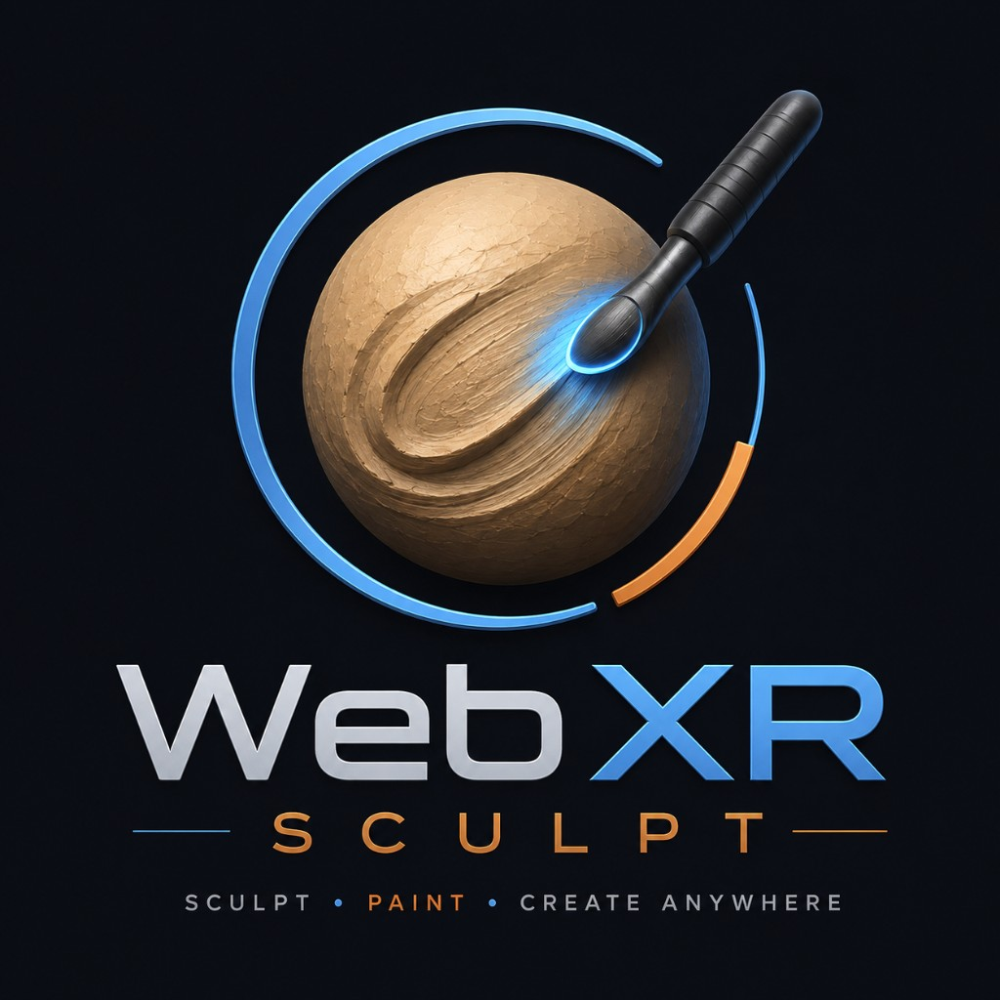

---

## Quick paths

| You want… | Do this |
|---|---|
| Sculpt on a monitor | Open the app → welcome **Let’s Sculpt** → use Form/Paint icons or hotkeys |
| Sculpt in the room | Quest Browser (HTTPS) → welcome → **Let’s Sculpt** → XR setup (MR/VR) → enter |
| Skip the welcome next time | Check **Don’t show this again** before Let’s Sculpt |
| Tunnel / Quest HTTPS | [`../tools/xr-tunnel.txt`](../tools/xr-tunnel.txt) |

---

## Form tools

| | Tool | What it does |
|:---:|---|---|
| 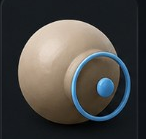 | **Brush** | Push / pull clay along the surface normal. Main block-out tool. |
| 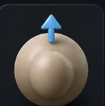 | **Inflate** | Expand or shrink volume inside the brush. |
| 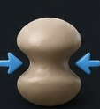 | **Pinch** | Pull verts toward the brush center — sharpen ridges. |
| 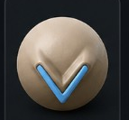 | **Crease** | Dig a hard crease / fold. |
| 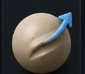 | **Drag** | Grab a patch and drag it in space. Keep radius/intensity moderate — high values stretch tris. |
| 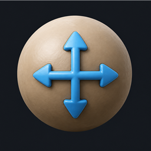 | **Move** | Limited topological grab (safer than free Drag for connected mesh). |
| 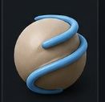 | **Twist** | Rotate clay inside the brush (wrist / stick in XR). |
| 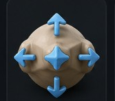 | **Local scale** | Scale a region in / out. |
| 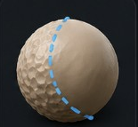 | **Smooth** | Relax noise. Desktop: hold **Shift**. XR: hold **both grips**, then sculpt. |
| 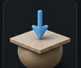 | **Flatten** | Planarize toward the brush plane. |
| 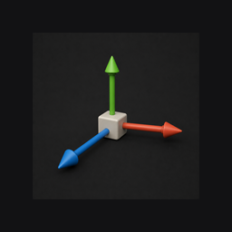 | **Transform** | Move / rotate / scale whole meshes (gizmo). Not a brush — no α stamps. |

**Negative / invert:** Desktop **Alt**. XR **right grip** (hold).

---

## Paint tools

| | Tool | What it does |
|:---:|---|---|
| 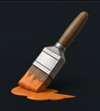 | **Paint** | Color + roughness / metal (write flags in OPTS). Paints into live maps when UVs + maps exist. |
| 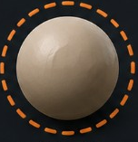 | **Mask** | Protect regions from sculpt/paint. |
| 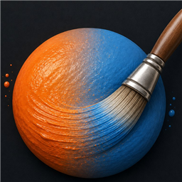 | **Soften** | Blend neighboring colors / materials (1-ring). |

Clay-friendly metal/rough defaults apply until you edit them. Matcap/Flat show paint as **color**; **PBR** uses metal/rough.

---

## Alpha stamps (α maps)

1. On FORM or PAINT, focus the **α maps** chip → **Y** / click to turn **ON**.  
2. ALPHA tab appears — pick a stamp, optional **lock** + **angle**.  
3. **OFF** restores a round freehand falloff (last stamp remembered).

Transform never stamps. Best on Brush / Inflate / Crease / Pinch / Flatten / Paint / Mask; Smooth & Soften get shaped falloff.

---

## Desktop essentials

- **Form / Paint** icon grids in the sculpt sidebar (same art as XR).  
- Radius / intensity / hardness in the tool panel; tablet pressure when available.  
- **Files:** Save/Load `.sgl`, Import OBJ/PLY/STL/SGL/GLB, Export OBJ / OBJ+MAPS / GLB / PLY / STL.  
- **Camera:** Local Snapshot PNG + Start/Stop video (virtual view — not OS Cast).  
- Undo / Redo: usual shortcuts + UI.

---

## Quest / XR essentials

Left dock tabs: **FORM · PAINT · α · OPTS · SPACE**

| Hand | Highlights |
|---|---|
| **Right** | Trigger = sculpt · Grip = negative · Stick = orbit / dolly · B = undo · Stick click = redo |
| **Left** | Stick = cycle tools · Squeeze+stick = radius / intensity · X = tabs · Y = confirm / toggle |
| **Both grips ~2.5s** | Exit XR when the DOM overlay isn’t available in MR |

**SPACE** moves the sculpture in the *room* (scale, distance, turntable) — not mesh Transform.  
**OPTS:** Save/Load `.sgl` (IndexedDB), Import/Export, Snapshot/Record, Add primitives, clay/symmetry/wireframe.

Prefer Import from the 2D browser **before** entering XR if the immersive picker fails.

---

## First session tips

1. Start with **Brush** + moderate radius; Smooth often.  
2. Use **Drag** gently — huge R/I stretches topology.  
3. **ADD** shapes stack at the origin; use **Transform** to pose them (Workspace re-fit on every ADD is a known polish item).  
4. Paint looks “clay” under Matcap; switch to **PBR** to judge metal/rough.  
5. Export **GLB** when you need maps; keep **`.sgl`** for full project continuity here.

---

## Links

- Repo: [MessiahStudios/webxr-sculptgl](https://github.com/MessiahStudios/webxr-sculptgl)  
- Studio: [MessiahStudios](https://github.com/MessiahStudios) · [messiahstudios.site](https://www.messiahstudios.site)  
- Roadmap / design: [`../XR_Roadmap.MD`](../XR_Roadmap.MD)
